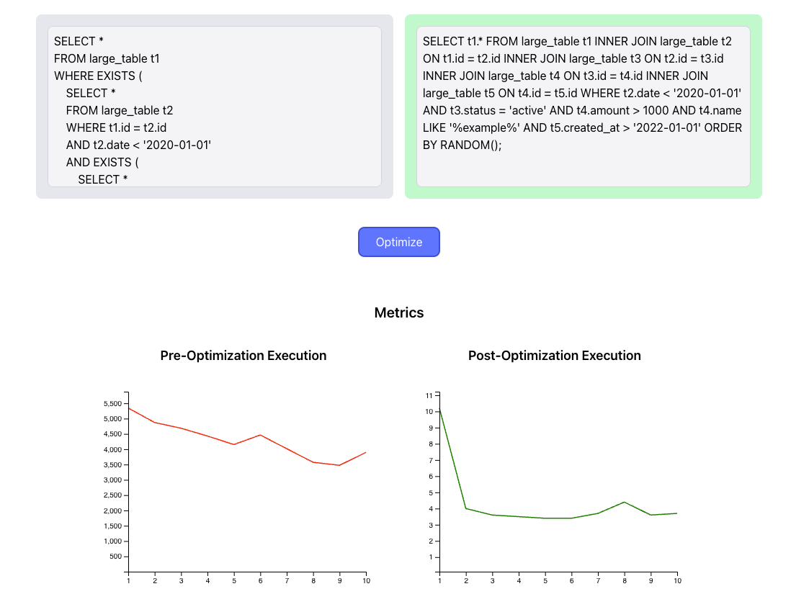

# SQL Query Optimization with AI and TPC-H Data

## Project Overview
This project focuses on optimizing SQL queries using AI models, specifically leveraging dbgen-generated data as a proxy for performance profiling.
The main goal is to analyze user queries and provide optimized versions to improve execution efficiency.

## Key Features
AI-powered optimization of SQL queries.
Comparison of pre- and post-optimization performance metrics.
Utilization of dbgen-generated data to simulate real-world database environments.
Performance profiling for throughput, response time, and other key metrics.

## Project Structure
**frontend/**: Contains the React application for user input and displaying results.
**backend/**: Includes the Express.js server for handling API requests and integrating with AI models.
**dbgen/**: Data generation scripts to create synthetic datasets based on TPC-H schema.

## Getting Started

### Prerequisites
Node.js and npm installed on your machine.
PostgreSQL database set up for running queries.
TPC-H dbgen tool downloaded.

### Installation
1. Clone the repository:

2. Install backend dependencies:

3. Install frontend dependencies:

4. Set up environment variables:

Create a `.env` file in the backend directory for API keys and database configuration.
You will need the gemini api key and your database configuration

### Generating 1GB of dbgen Data
1. Navigate to the dbgen directory.
2. Run the dbgen tool with the following command to generate data:
```bash
./dbgen -s 1
```

### Running the Project
1. Start the backend server:

2. Start the frontend application:

3. Access the application at `http://localhost:3000`.

## Usage
Input your SQL query in the provided text area.
Click on "Optimize" to send the query to the backend for processing.
View the optimized query and performance metrics displayed on the screen.

## Performance Metrics
Average execution time before and after optimization.
Execution times for each query run during profiling.
Metrics are generated based on synthetic data from dbgen to ensure consistency and reliability.

## Results
The project demonstrates significant improvements in execution time after optimization.
Example metrics:
- **Original Query Average Execution Time**: 4291.5 ms
- **Optimized Query Average Execution Time**: 4.3 ms

## Conclusion
This project showcases the potential of AI in optimizing SQL queries and emphasizes the importance of using standardized datasets like those generated by dbgen for meaningful performance analysis.

